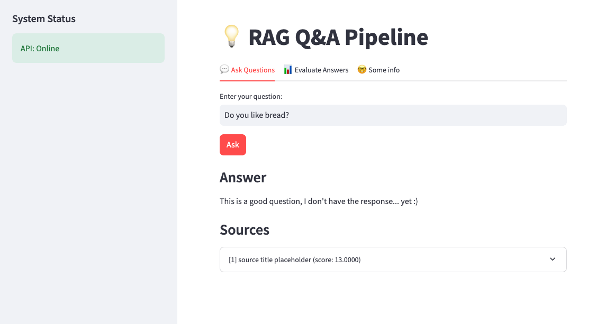

# RAG Q&A Pipeline

A Retrieval-Augmented Generation (RAG) application that answers questions using **Simple English Wikipedia** as its knowledge base.  
The app runs entirely **locally** with no paid APIs and allows you to ask questions, ingest data, and evaluate answer quality.

---

## 📌 What the App Does

This app helps you explore and query knowledge from Wikipedia in a structured way.  
Key functionalities:

- **Ingest data**: Import Wikipedia articles into the local vector store.  
- **Ask questions**: Retrieve relevant passages and generate answers.  
- **Evaluate answer quality**: Compare generated answers against a reference with dummy metrics for now.

---

## 🖼 Screenshot



---

## 🏗 Structure & Libraries

- **Backend**: FastAPI  
- **Frontend**: Streamlit  
- **Vector Search**: ChromaDB + Sentence Transformers  
- **Reranker**: Cross-encoder (MS MARCO MiniLM)  
- **Answer Generation**: Flan-T5 seq2seq model  

The internal pipeline retrieves, re-ranks, and generates answers, but details are **in progress**.

---

## ⚡ Docker Setup

The easiest way to run the app is with Docker. The repository includes separate Dockerfiles for the backend API and the Streamlit UI, managed with `docker-compose`.

### Services

- **api**: FastAPI backend
  - Exposes port `8000`
  - Uses volumes for model cache and ChromaDB data
  - Healthcheck endpoint at `/health`
- **ui**: Streamlit frontend
  - Exposes port `8500`
  - Connects to the API service internally (`API_URL=http://api:8000`)

### Volumes

- `model_cache`: stores Hugging Face model cache
- `chroma_data`: stores ChromaDB persistent data

### Build & Run

From the `docker` folder, run:

```bash
docker compose up --build